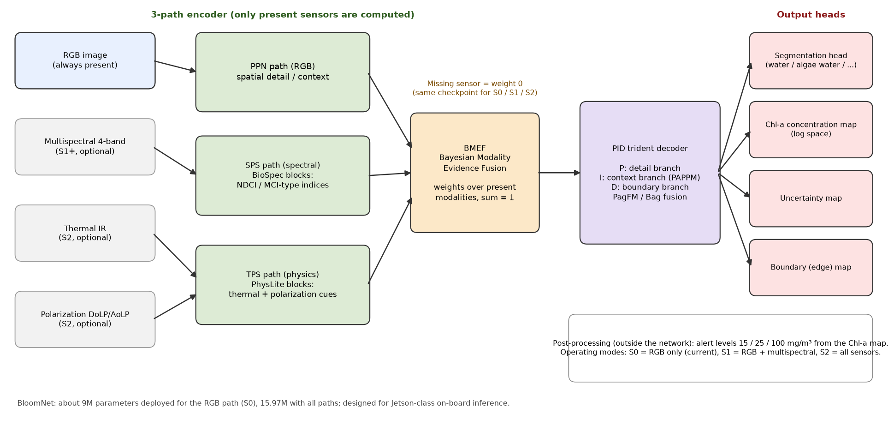
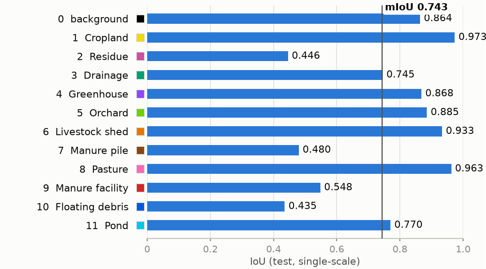
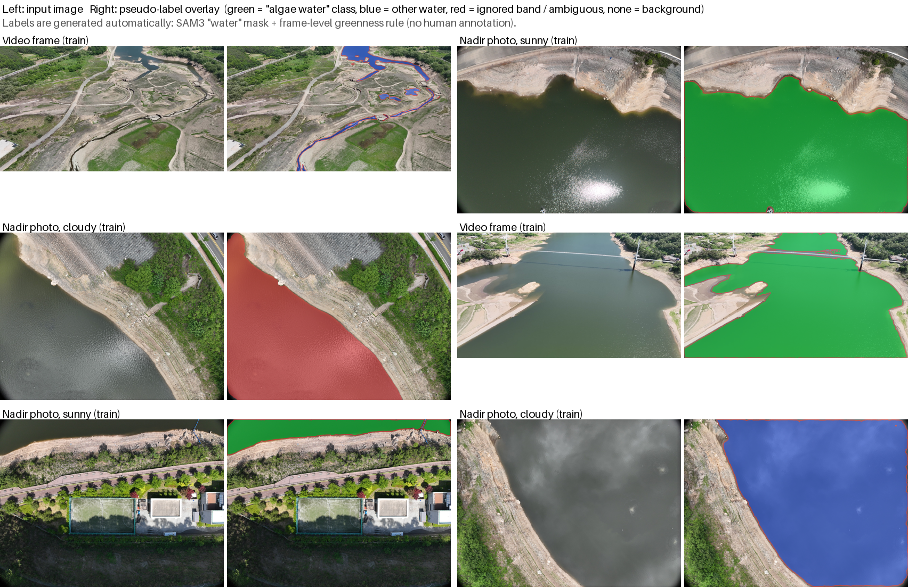
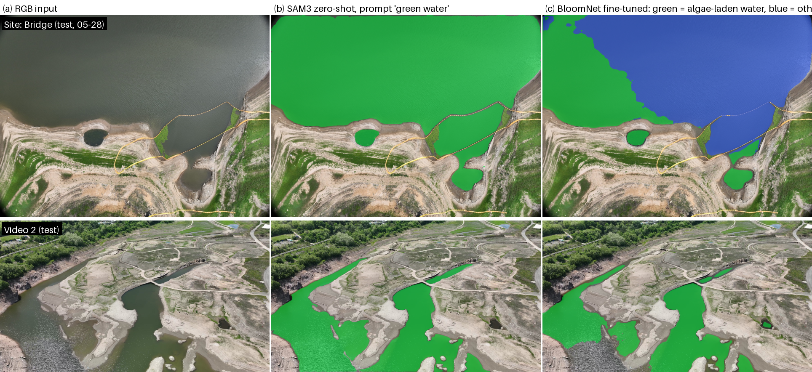

# BloomNet

드론 탑재용 **녹조(algal bloom) 영역 분할 모델**입니다. RGB 카메라만 있는 지금 단계부터, 앞으로 다중분광·열화상·편광 카메라가 추가되는 단계까지 **같은 모델 구조와 같은 체크포인트**로 이어서 쓰도록 설계했습니다. 출력은 녹조 영역 분할 지도이며, 센서가 갖춰지면 엽록소-a(Chl-a) 농도 지도와 신뢰도 지도까지 함께 냅니다.

> BloomNet is a lightweight (about 9M parameters) multimodal segmentation network for on-board algal-bloom mapping from drone imagery. It fuses RGB, multispectral, thermal and polarization inputs when they exist, and degrades gracefully to RGB-only.

---

## 1. 모델이 하는 일

| 입력 | 출력 |
|---|---|
| RGB 영상 (필수) | 분할 지도: 배경 / 물 / 녹조 수역 |
| 다중분광 4밴드 (선택, S1 단계) | 엽록소-a 농도 지도 (log 공간) |
| 열화상 (선택, S2 단계) | 불확실도 지도 |
| 편광 DoLP/AoLP (선택, S2 단계) | 경계(edge) 지도 |

- **운영 단계**: S0 = RGB 만(현재), S1 = RGB + 다중분광, S2 = 전 센서. 센서가 없으면 해당 경로는 계산하지 않고 융합 가중치가 0이 됩니다.
- **탑재 목표**: Jetson 급 기내 컴퓨터. 배포 시 파라미터 8.95M(RGB 경로), 전 센서 15.97M. A100 에서 1920×1088 입력 1프레임에 약 55 ms.

## 2. 구조



- **3경로 인코더**: RGB(PPN), 분광(SPS, 엽록소 지수형 BioSpec 블록), 물리(TPS, 열·편광 PhysLite 블록). 존재하는 센서의 경로만 실행합니다.
- **BMEF (Bayesian Modality Evidence Fusion)**: 경로별 특징을 증거로 보고 신뢰도에 따라 가중 합산합니다. 가중치의 합은 항상 1이므로 센서가 빠져도 출력 크기가 흔들리지 않습니다.
- **PID 3분기 디코더**: 세부(P), 문맥(I, PAPPM), 경계(D) 분기를 PagFM/Bag 으로 합쳐 해상도를 복원합니다.
- **4개 헤드**: 분할, Chl-a 회귀, 불확실도, 경계. 경보 3단계(15/25/100 mg/m³)는 네트워크 밖 후처리입니다.

## 3. 학습 원리 (간략)

**손실.** 분할은 OHEM 교차엔트로피 + Dice, 경계 헤드는 경계 손실, 보조 출력(aux)은 감쇠 가중치로 더합니다. 가중치 EMA 사본으로 평가·저장합니다.

**결측 센서 학습.** 학습 중 센서 조합을 무작위로 끄는 modality dropout 으로, 한 체크포인트가 S0/S1/S2 어느 조합에서도 동작하도록 만듭니다.

**두 단계 학습.**

1. **임시 사전학습(S0-RGB)**: 녹조 라벨이 아직 없어, 공개 하천 항공영상 데이터(AI Hub 092, 12개 오염원 클래스, 96,340장)로 처음부터 학습해 "항공영상에서 영역을 나누는 기본 능력"을 얻습니다. 아래는 그 시험 세트의 클래스별 IoU 입니다.

   

2. **가상 라벨 미세조정(K-water 시험비행 영상)**: 사람이 만든 라벨이 없으므로 라벨을 자동 생성합니다.
   - 물 영역: 범용 분할 모델 **SAM3** 에 `"water"` 프롬프트를 주어 얻은 마스크. (`"algae"` 프롬프트는 거의 반응하지 않았습니다.)
   - 녹조 수역 / 물: 물 영역의 **녹색도**(녹색 비율 − 청색 비율)의 프레임 평균이 임계(0.02) 이상이면 "녹조 수역", 미만이면 "물". 임계 근처 프레임의 물, 물가 띠, 작은 조각은 무시(255).
   - 이 라벨로 사전학습 가중치에서 분류 헤드만 3클래스로 바꿔 30 epoch 미세조정합니다(512² 무작위 잘라내기, 배율·뒤집기·색 변형).

   여기서 "녹조 수역"은 **규칙으로 정한 가상 라벨의 클래스 이름**이며 실제 녹조 여부는 확인되지 않은 값입니다. 따라서 이 데이터로 잰 수치는 정확도가 아니라 **가상 라벨과의 일치도**입니다.

## 4. 학습 데이터 수량

가상 라벨 미세조정에 쓴 수량입니다(동영상은 1초당 1프레임, 사진은 M3M 카메라 수직 촬영).

| 분할 | 출처 | 장수 |
|---|---|---|
| train | 동영상 1(댐상류-하류) 1초당 1프레임, 앞 85% | 288 |
| train | 05-15 M3M 사진 | 321 |
| train | 05-28 M3M 댐부근 3개 비행 | 189 |
| **train 합계** | | **798** |
| val | 동영상 1 뒤 15% 프레임 (512² 조각) | 102 |
| val | 05-15 M3M 사진 2개 비행 (512² 조각) | 54 |
| **val 합계** | | **156** |
| test | 동영상 2(댐하류-상류) 1초당 1프레임 전부 | 383 |
| test | 05-28 M3M 정자앞 | 67 |
| test | 05-28 M3M 출렁다리하단 | 119 |
| **test 합계** | | **569** |

test 는 학습에 쓰지 않은 동영상과 학습에 없는 장소·날씨(흐린 날)입니다.

**학습 데이터 예시** (왼쪽 입력, 오른쪽 가상 라벨: 초록 = 녹조 수역 클래스, 파랑 = 물, 빨강 = 무시)



## 5. 결과 예시

학습에 쓰지 않은 시험 자료에서 (a) 입력, (b) SAM3 zero-shot `"green water"`, (c) BloomNet 미세조정 결과입니다. BloomNet 은 회색 본류와 녹색 물을 한 프레임 안에서 나누고 좁은 물길 경계까지 잡습니다. 가상 라벨과의 일치도는 동영상 2 에서 녹조 수역 클래스 IoU 0.79, 학습에 없는 장소의 흐린 날 사진에서 물 영역 IoU 0.92 였습니다(정답 라벨이 없어 정확도는 알 수 없음).



## 6. 사용법

```bash
# 환경
pip install -r requirements.txt          # SAM3 를 쓰려면 transformers>=5 와 facebook/sam3 가중치(승인 필요)
export PYTHONPATH=$PWD                    # 모든 명령은 저장소 루트에서 실행

# (1) S0-RGB 사전학습: AI Hub 092 를 images/<split>/<scene>/*.png, labels/.../*_labelids.png 레이아웃으로 준비한 뒤
python -m bloomnet.tools.train --config bloomnet/configs/s0_rgb_aihub092.yaml --set data.root=<AIHUB092_ROOT>

# (2) 가상 라벨 데이터셋 만들기
bash scripts/kwater/extract_frames.sh <video1.mp4> data/frames/video1        # 1초당 1프레임, 1920x1080
python scripts/kwater/resize_stills.py --src <flight_dir> ... --out data/frames  # 사진 3장 중 1장, 가로 1320
python scripts/kwater/sam3_masks.py --inputs data/frames/* --out data/sam3_out   # SAM3 "water" 마스크
python scripts/kwater/make_pseudo_labels.py --images data/frames --sam3_out data/sam3_out --out data/pseudo \
    --video_head video1=0.85 --train clear_m3m overcast_dam --val clear_m3m_alt150 --test video2 overcast_site --thr 0.02

# (3) 미세조정 (3클래스, 사전학습 가중치에서 시작)
python -m bloomnet.tools.train --config bloomnet/configs/kwater_ft_s0.yaml \
    --set data.root=data/pseudo --set train.init_from=<S0_checkpoint.pt>

# (4) 가상 라벨과의 일치도 평가, 결과 영상
python scripts/kwater/eval_pseudo.py --config outputs/<run>/config.resolved.yaml --ckpt outputs/<run>/best.pt \
    --images data/frames --sam3_out data/sam3_out --sets video2 overcast_site --out eval.json
python scripts/kwater/render_video.py --video <video2.mp4> --config outputs/<run>/config.resolved.yaml --ckpt outputs/<run>/best.pt --out_dir outputs/videos

# 테스트 (CPU)
CUDA_VISIBLE_DEVICES="" python -m pytest bloomnet/tests -q
```

## 7. 저장소 구성

```
bloomnet/            모델·데이터·학습 엔진 패키지
  configs/           s0_rgb_aihub092.yaml (사전학습), kwater_ft_s0.yaml (가상 라벨 미세조정), s1_rgb_ms4.yaml, s2_full.yaml
  models/ modules/   3경로 인코더, BMEF, PID 디코더, 헤드
  data/              데이터셋 어댑터, 증강, 분광 지수
  engine/ losses/    학습 루프, 평가, 손실
  tools/             train / eval / export(ONNX) / benchmark / predict_media
  tests/             단위·통합 테스트 (CPU)
scripts/kwater/      프레임 추출, SAM3 마스크, 가상 라벨 생성, 일치도 평가, 결과 영상
docs/figures/        구조도, 데이터 예시, 결과 예시
```

## 8. 주의

- 데이터·가중치는 저장소에 포함하지 않습니다. K-water 시험비행 영상과 AI Hub 데이터는 각 제공처의 이용 조건을 따릅니다.
- SAM3 는 Meta 의 모델과 라이선스를 따르며, 가중치는 Hugging Face `facebook/sam3` 에서 승인 후 받습니다.
- 가상 라벨은 사람이 만든 정답이 아닙니다. 현장 라벨(녹조 마스크, Chl-a 측정)이 확보되면 정확도를 다시 평가해야 합니다.
